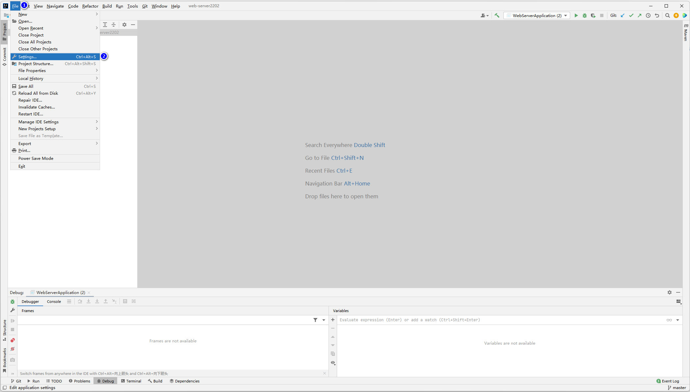
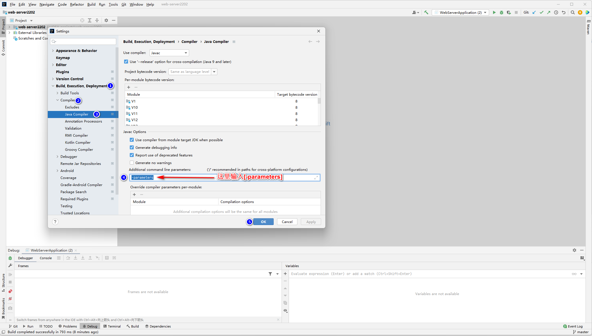

# 这是编译器参数

原因:

由于反射机制默认获取不到一个方法的参数名，即:反射机制通过Method获取到参数后，再得到参数名时返回的字符串为arg0,arg1,arg2....

但是在编译器中添加一个参数即可解决该问题。

IDEA中设置该参数的步骤参考下图:

选择File菜单并继续选择Settings

然后在弹出框顺序选择

Build,Execution,Deployment->Compiler->Java Compiler

并在右侧图中位置输入内容:

-parameters

之后点击OK即可完成设置

